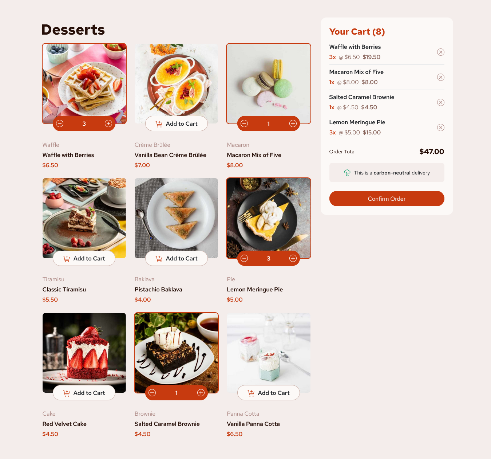

# Frontend Mentor - Product list with cart solution

This is my solution to the [Product list with cart challenge on Frontend Mentor](https://www.frontendmentor.io/challenges/product-list-with-cart-5MmqLVAp_d). Frontend Mentor challenges help you improve your coding skills by building realistic projects.

**NOTE: I did not have access to the Figma/Sketch file, so the design is far from being pixel perfect.**

## Table of contents

- [The challenge](#the-challenge)
- [Screenshots](#screenshots)
- [Links](#links)
- [Built with](#built-with)
- [Author](#author)

## The challenge

Users should be able to:

- Add items to the cart and remove them
- Increase/decrease the number of items in the cart
- See an order confirmation modal when they click "Confirm Order"
- Reset their selections when they click "Start New Order"
- View the optimal layout for the interface depending on their device's screen size
- See hover and focus states for all interactive elements on the page

## Screenshots

## Full Page View

## Modal Page View

## Links

- Live Site URL: [Solution Hosted using Vercel](https://product-list-with-cart-pi.vercel.app/)

## Built with

- Semantic HTML5 markup
- CSS Custom Properties
- SASS
- Bootstrap
- JavaScript
- DOM Manipulation
- Event Handling
- Mobile-first workflow

## Author

- Frontend Mentor - [@Marvin-Figueroa](https://www.frontendmentor.io/profile/Marvin-Figueroa)
